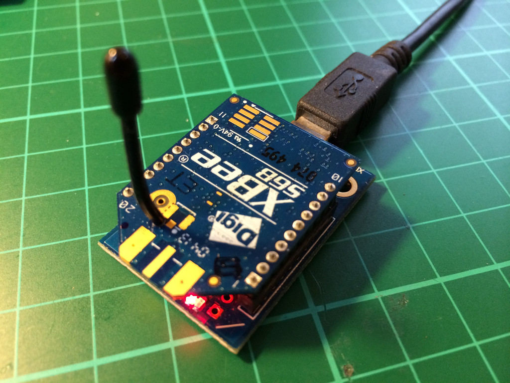
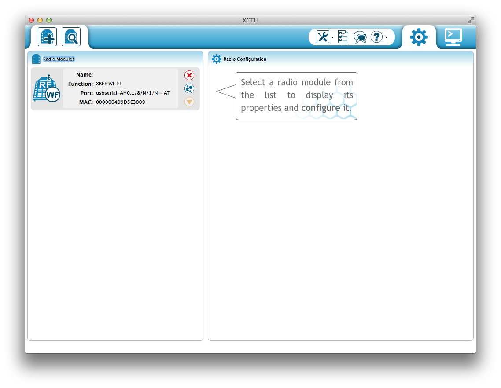

##README

The Digi XBee S6B Wi-Fi radio can make it really easy to build [TRSP](https://github.com/TheThingSystem/steward/wiki/Thing-Sensor-Reporting-Protocol) things as it can be easily configured to send multicast UDP packets by default in serial passthrough mode. The means that no complicated networking needs to be done in the Arduino sketch, instead you just need to write the TRSP JSON packet to the Serial port connected to the XBee.

###Download XCTU

The easiest way to configure your XBee radio is to use X-CTU. This is a firmware confguration utility available from Digi. Until recently this only ran on MS Windows, however a new version has recently been released [that supports both OS X and MS Windows](http://www.faludi.com/2013/09/22/new-xctu-for-mac-windows/).

Download X-CTU and install it on your laptop or desktop machine. When you run it you should get something that looks a lot like this,

Now go ahead and plug your XBee Wi-Fi radio into your laptop using an appropriate [adaptor board](http://www.adafruit.com/products/247).

Hit the "plus" button at the upper left of the X-CTU interface to bring up a list of Serial/USB ports. Select the correct port and hit "Finish." A popup window will appear as X-CTU looks for any radios connected to that port. Afterward you should get something that looks a lot like this,

