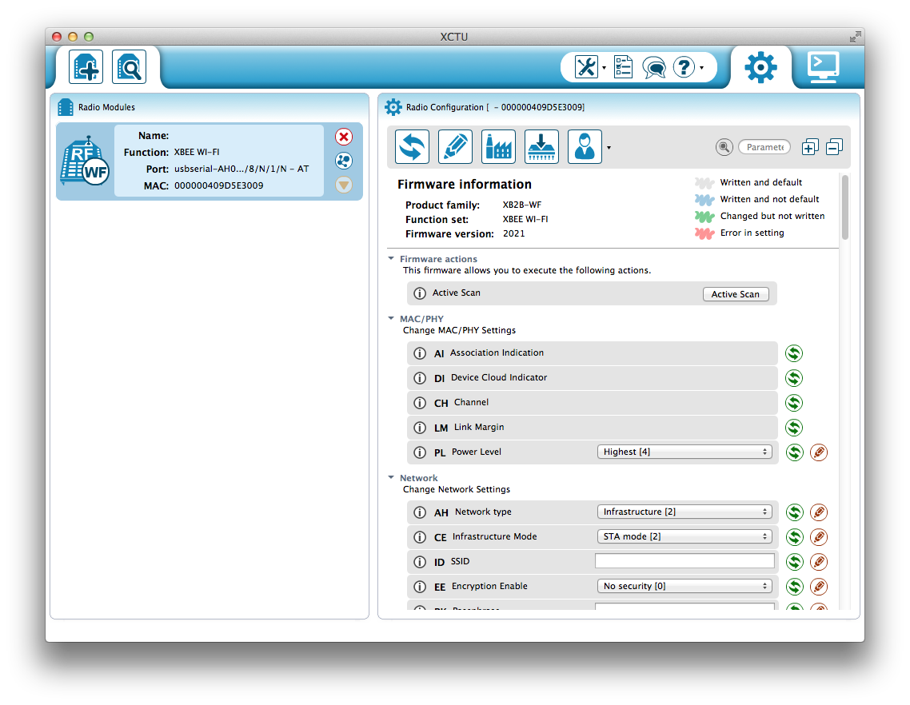
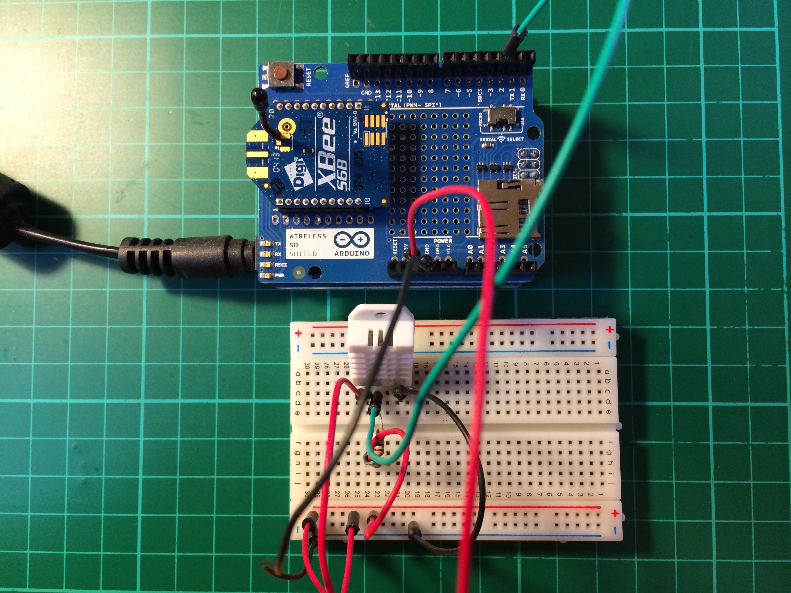
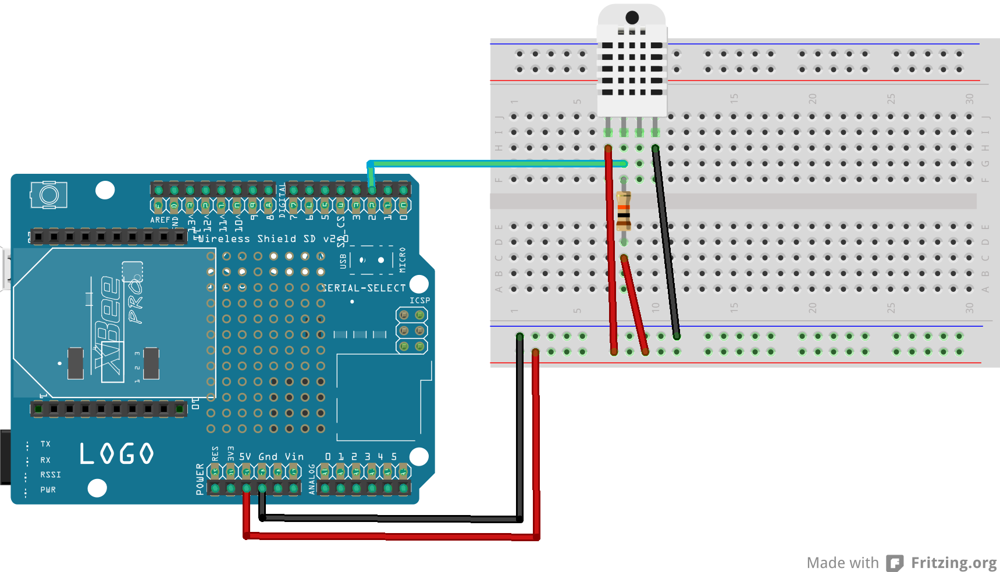

##README

The Digi XBee S6B Wi-Fi radio can make it really easy to build [TRSP](https://github.com/TheThingSystem/steward/wiki/Thing-Sensor-Reporting-Protocol) things as it can be easily configured to send multicast UDP packets by default in serial passthrough mode. The means that no complicated networking needs to be done in the Arduino sketch, instead you just need to write the TRSP JSON packet to the Serial port connected to the XBee.

###Download XCTU

The easiest way to configure your XBee radio is to use X-CTU. This is a firmware confguration utility available from Digi. Until recently this only ran on MS Windows, however a new version has recently been released [that supports both OS X and MS Windows](http://www.faludi.com/2013/09/22/new-xctu-for-mac-windows/).

Download X-CTU and install it on your laptop or desktop machine. When you run it you should get something that looks a lot like this,

###Configuring the Radio

Now go ahead and plug your XBee Wi-Fi radio into your laptop using an appropriate [adaptor board](http://www.adafruit.com/products/247).

Hit the "plus" button at the upper left of the X-CTU interface to bring up a list of Serial/USB ports. Select the correct port and hit "Finish." A popup window will appear as X-CTU looks for any radios connected to that port. Afterward you should get something that looks a lot like this,

Go ahead and click on the radio in the left-hand pane. This will trigger another popup while X-CTU reads the firmware values from the radio. These will appear in the right-hand pane, as below,

You should go ahead and reset the firmware configuration to the factory default by pushing the "Factory" button in the tab bar above the firmware values, and then the "Pencil" button to write the configuration back to the radio. A popup will appear while this occurs.

Scroll down to the _Network_ section of the configuration and set the ID, EE and PK lines to be the SSID, Encryption mode and Passphrase for your Wi-Fi network. These lines should turn green showing that they've been modified.

Click on the "Pencil" button again to write them to your radio, the lines should turn blue, showing that they've been modified to the radio, and written to the radio.

Scroll down to the _Addressing_ section of the configuration and set the DL, the destination address, to be the [TRSP](https://github.com/TheThingSystem/steward/wiki/Thing-Sensor-Reporting-Protocol) multicast address of 224.192.32.20.

You should also set the DE, the destination port, to the correct TRSP port. However you should note that the XBee wants you to enter the port numbe in hexidecimal. Since we want port 22601 we need to enter 5849 here for the destination port number. These lines should turn green, as before.

[X-CTU](images/xctu-5.png)

Click on the "Pencil" button again to write them to your radio, the lines should turn blue, showing that they've been modified to the radio, and written to the radio.

We have now finished configuring the XBee radio. You might want to go and check your home router to make sure it has successfully associated with your wireless network. The first time it does so, it might take a few moments to acquire a DHCP address.

You can now unplug your XBee Wi-Fi from the XBee adaptor connected to your laptop.

###Wiring the Breadboard

We're going to use an [Arduino Leonardo](http://arduino.cc/en/Main/arduinoBoardLeonardo) and the [Arduino Wireless SD Shield](http://arduino.cc/en/Main/ArduinoWirelessShield) along with a [DHT-22](http://www.adafruit.com/products/385) sensor to create a simple weather station measuring temperature and pressure which will report its readings via [TRSP](https://github.com/TheThingSystem/steward/wiki/Thing-Sensor-Reporting-Protocol) to the steward.

###Running the Sketch

